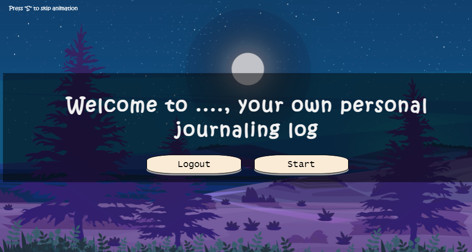

MyJournal
-----

## Introduction

MyJournal is a website that allows you to write and check your journal entries. Kepp track of your moods, goals and other thoughts through the days.




## Tech Stack (Dependencies)

### 1. Backend Dependencies
All the backend dependencies can be downloaded by running:
```
pip install -r requirements
```

### 2. Frontend Dependencies
The website's frontend needs **HTML**, **CSS**, and **Javascript**.
This website uses **JQuery**.

## Main Files: Project Structure

  ```sh
  ├── README.md
  ├── app.py *** the main driver of the app. "python app.py" to run after installing dependencies
  ├── config.py *** to set up the database URLs, etc
  ├── requirements.txt *** The dependencies we need to install with "pip3 install -r requirements.txt"
  ├── static
  │   ├── css *** the stylesheet of a template shares the same name
  │   ├── assets
  │   └── js *** the script of a template shares the same name
  ├── auth *** manages the authentification of users
  │   ├── server.py *** the authentification endpoints and Auth0 configuration
  │   ├── token.py *** necessary functions to take the user id and email from a given token
  ├── models *** database models
  └── templates
  ```


